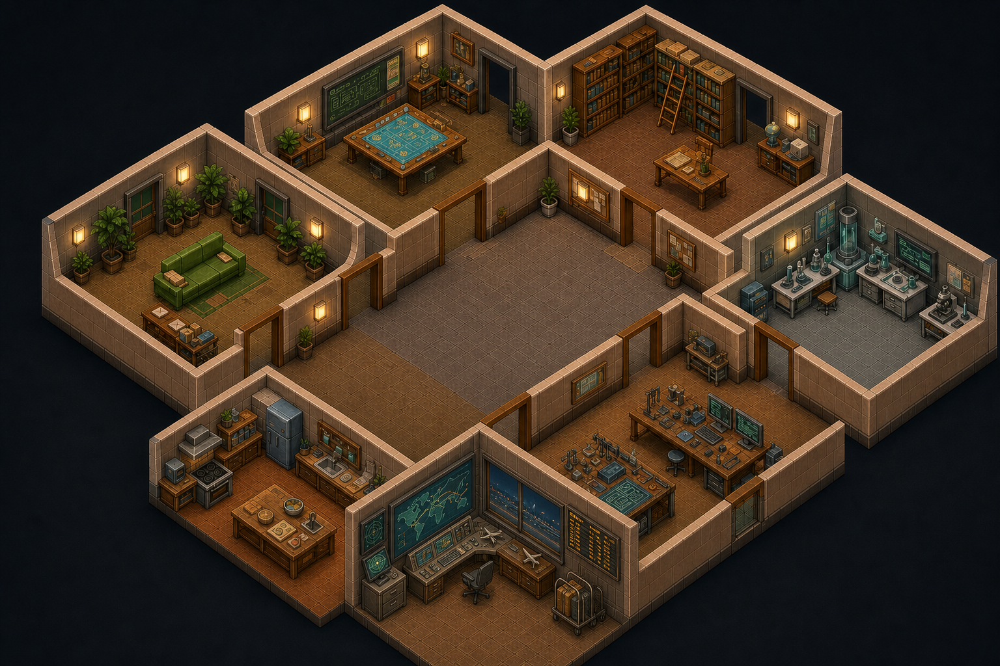

<p align="center">
  
</p>

<p align="center">
  <strong>A local-first interactive headquarters for academic, career and personal planning.</strong><br/>
  Specialized agents turn complex goals into visible missions, structured results and user-controlled actions.
</p>

<p align="center">
  <a href="https://github.com/PauMonterosa/career-quest-hq/actions/workflows/refresh-intelligence.yml">
    
  </a>
  
  
  
  
  
  
</p>

<p align="center">
  <a href="#overview">Overview</a> ·
  <a href="#agents">Agents</a> ·
  <a href="#architecture">Architecture</a> ·
  <a href="#getting-started">Getting started</a> ·
  <a href="#safety--privacy">Safety</a> ·
  <a href="#documentation">Docs</a>
</p>

---

## Overview

**Career Quest HQ** is an experimental productivity system that represents academic and professional planning as a living, interactive pixel-art headquarters.

Instead of navigating another collection of static dashboards, the user manages a small team of specialized agents. Each agent owns a defined area of responsibility, works from a dedicated room, exposes an allow-listed set of missions and returns structured, inspectable results.

When a mission starts, the selected agent visibly moves through the headquarters, works at the relevant station and reports back through the product UI. The game layer is therefore not just decoration: it is a visual representation of system state.

```text
Private planning data / public evidence
                 ↓
         Specialized agent
                 ↓
              Mission
                 ↓
      Visible HQ activity
                 ↓
       Structured result
                 ↓
       Review / approval
```

### What it currently covers

- 🎓 Master's programme research and comparison
- 🔬 TFG and research-centre scouting
- ⏱️ Deadline detection and weekly planning
- ✉️ Email drafting with explicit user review
- 🧰 Portfolio and GitHub project auditing
- 🍲 Food, shopping and weekly logistics coordination
- ✈️ European flight-deal monitoring
- 🌐 Daily public-source intelligence refresh
- 📊 Defensive, read-only Excel import
- 📱 Responsive PWA foundation

---

## The HQ

<p align="center">
  
</p>

The application is built around an interactive isometric headquarters rendered with **Phaser 3**. React remains responsible for operational UI, accessibility and application state, while Phaser owns the world, rooms, agents and mission feedback.

Agents can be selected from the scene or through accessible React controls. Their visual state is synchronized with the product UI so the system can be understood without relying on animation alone.

### Semantic agent states

| State | Meaning |
|---|---|
| `idle` | Agent is available |
| `walking` | Moving to a workstation |
| `working` | Mission is being executed |
| `waiting_approval` | User decision is required |
| `completed` | Result is ready |
| `error` | Mission needs attention |

---

## Agents

Career Quest HQ currently contains **seven specialized agents**.

| Agent | Role | HQ area | Typical responsibility |
|---|---|---|---|
| **ATLAS** | Master Programme Scout | Masters Archive | Compare programmes and verify official sources |
| **NOVA** | TFG & Research Scout | TFG Laboratory | Research centres, projects and TFG signals |
| **ECHO** | Email & Communication Assistant | Mail Room | Prepare reviewable communication drafts |
| **CHRONOS** | Deadline Manager | Control Room | Detect urgency and build weekly plans |
| **PIXEL** | Portfolio & Project Coach | Portfolio Workshop | Audit projects and identify portfolio priorities |
| **BRASA** | Chef & Provisions Coordinator | Kitchen | Coordinate menus, shopping, budget and busy weeks |
| **SKY** | European Flight Deal Pilot | Air Operations | Surface interesting European flight fares |

Agents are deliberately **not unrestricted chatbots**. Each one owns explicit skills and the backend rejects missions outside its allow-list.

---

## Core interaction model

```text
USER STARTS A MISSION
        │
        ▼
React marks the agent as walking
        │
        ▼
Phaser moves the agent to its station
        │
        ▼
Agent becomes working
        │
        ▼
FastAPI validates and executes the skill
        │
        ▼
Result is persisted and returned
        │
        ├── completed
        ├── waiting_approval
        └── error
        │
        ▼
HQ feedback + result toast + result drawer
```

The frontend animation improves feedback, but the **backend remains authoritative** for final task status and structured output.

---

## Live intelligence radar

Career Quest HQ is not limited to reorganizing local workbook data.

A scheduled GitHub Actions workflow refreshes public-source intelligence and stores only public evidence in:

```text
frontend/public/data/intelligence.json
```

The current radar supports workflows such as:

- **ATLAS** → official master's programme sources
- **NOVA** → research centres, projects, people and publications
- **CHRONOS** → private tasks combined with detected deadline signals
- **ECHO** → drafts informed by research results
- **PIXEL** → live public GitHub repository auditing

The scheduled workflow is located at:

```text
.github/workflows/refresh-intelligence.yml
```

Run the radar manually:

```powershell
Set-Location backend
.\.venv\Scripts\python.exe scripts\refresh_intelligence.py
```

Every web finding should retain its source URL so results remain inspectable.

---

## Architecture

<p align="center">
  
</p>

Career Quest HQ uses a simple local two-process architecture.

### Frontend

**React + TypeScript + Vite**

Responsible for:

- application state
- Agent Inspector
- mission controls
- result presentation
- accessibility
- local workbook import
- API communication
- responsive product shell

**Phaser 3**

Responsible for:

- isometric HQ world
- rooms and stations
- agent sprites
- navigation graph
- movement
- idle roaming
- dialogue
- visual status and mission feedback

React and Phaser communicate through a typed event bridge rather than directly owning each other's internals.

### Backend

**FastAPI + SQLAlchemy + Pydantic + SQLite**

Responsible for:

- API validation
- agent bootstrap
- skill allow-lists
- task orchestration
- persistence
- structured results
- approval state
- workbook ingestion
- external provider boundaries
- auditability

### Local data

SQLite acts as the local system of record. Source workbooks remain read-only and private data is not intended to be committed to the repository.

---

## Tech stack

| Layer | Technology |
|---|---|
| UI | React 18, TypeScript 5, Vite 6 |
| Interactive world | Phaser 3.90 |
| Backend | FastAPI, Python 3.11+ |
| ORM | SQLAlchemy 2 |
| Local database | SQLite |
| Validation/config | Pydantic Settings |
| Workbook import | OpenPyXL / read-excel-file |
| Testing | Pytest, TypeScript production build |
| Distribution | PWA manifest + service worker |
| Automation | GitHub Actions |

---

## Project structure

```text
career-quest-hq/
│
├── .github/
│   └── workflows/
│       └── refresh-intelligence.yml
│
├── backend/
│   ├── app/
│   │   ├── api/
│   │   ├── models/
│   │   ├── providers/
│   │   ├── schemas/
│   │   ├── services/
│   │   ├── config.py
│   │   ├── database.py
│   │   └── main.py
│   ├── scripts/
│   ├── tests/
│   └── pyproject.toml
│
├── data/
│
├── docs/
│   ├── agent_roles.md
│   ├── architecture.md
│   ├── design-system.md
│   ├── excel_mapping.md
│   ├── mobile-interaction-model.md
│   ├── roadmap.md
│   ├── safety_and_approvals.md
│   └── assets/
│
├── frontend/
│   ├── public/
│   │   ├── assets/
│   │   ├── data/
│   │   ├── icons/
│   │   ├── manifest.webmanifest
│   │   └── sw.js
│   └── src/
│       ├── api/
│       ├── components/
│       ├── data/
│       ├── game/
│       ├── services/
│       ├── styles/
│       ├── types/
│       ├── ui/
│       └── App.tsx
│
├── docker-compose.yml
└── README.md
```

---

## Getting started

### Prerequisites

- **Python 3.11+**
- **Node.js 20+**
- Git

### 1. Clone

```powershell
git clone https://github.com/PauMonterosa/career-quest-hq.git
Set-Location career-quest-hq
```

### 2. Optional local planning data

Place the source workbook at:

```text
data/pla_master_tfg_jan_2026_2027.xlsx
```

The importer treats the workbook as **read-only** and never writes changes back to the source file.

On first backend startup, supported sheets are imported when the database does not already contain master rows.

To intentionally start with a clean local import, remove:

```text
data/career_quest.db
```

before restarting the backend.

### 3. Start the backend

```powershell
Set-Location backend

python -m venv .venv
.\.venv\Scripts\Activate.ps1
python -m pip install -e ".[dev]"
python -m uvicorn app.main:app --reload --port 8000
```

Backend:

```text
http://localhost:8000
```

Interactive API docs:

```text
http://localhost:8000/docs
```

### 4. Start the frontend

Open a second terminal:

```powershell
Set-Location frontend
npm.cmd install
npm.cmd run dev
```

Open:

```text
http://localhost:5173
```

---

## Mobile / local network

Connect the computer and phone to the same Wi-Fi network.

Start FastAPI with LAN access:

```powershell
Set-Location backend
.\.venv\Scripts\python.exe -m uvicorn app.main:app --reload --host 0.0.0.0 --port 8000
```

Then start Vite:

```powershell
Set-Location frontend
npm.cmd run dev
```

Vite will display a network address similar to:

```text
http://192.168.1.25:5173
```

Open that address on the phone.

> `localhost` on the phone refers to the phone itself, not the development computer.

The frontend includes a PWA manifest, service worker and mobile icons. A normal production installation requires a secure HTTPS origin.

---

## API

Core endpoints include:

```http
GET  /health
GET  /agents
GET  /agents/{id}
GET  /agents/{id}/skills

GET  /masters
GET  /tfg-opportunities
GET  /tasks
GET  /emails
GET  /research-evidence

GET  /calendar/tasks.ics

POST /agents/{id}/tasks
```

Example mission request:

```json
{
  "skill": "suggest_shortlist"
}
```

The backend validates that the requested skill belongs to the selected agent before execution.

---

## Testing

### Backend

```powershell
Set-Location backend
.\.venv\Scripts\python.exe -m pytest
```

### Frontend production build

```powershell
Set-Location frontend
npm.cmd run build
```

The frontend build runs the TypeScript project build before Vite.

---

## Safety & privacy

Career Quest HQ is deliberately conservative with private information and consequential actions.

### Local-first principles

- source workbook remains read-only
- SQLite state stays local by default
- private workbook data is not committed
- credentials and personal exports should never be committed
- public research evidence is separated from private planning data

### Approval boundaries

The system does **not** silently:

- send emails
- overwrite source workbooks
- submit applications
- perform unapproved external actions

A consequential workflow should follow:

```text
Agent prepares action
        ↓
User inspects exact proposal
        ↓
Explicit approval
        ↓
External action
```

This keeps automation useful without hiding control from the user.

---

## Responsive behavior

**Desktop**

- HQ-first workspace
- Agent Inspector beside the scene
- result toast and collapsible result drawer

**Compact tablet**

- inspector can move below the HQ
- scene remains readable rather than being aggressively compressed

**Mobile foundation**

- horizontal accessible agent navigation
- touch-friendly controls
- compact result feedback
- PWA support

The dedicated mobile interaction model is documented in [`docs/mobile-interaction-model.md`](docs/mobile-interaction-model.md).

---

## Documentation

Technical documentation lives in [`docs/`](docs/):

- [`architecture.md`](docs/architecture.md) — system boundaries
- [`agent_roles.md`](docs/agent_roles.md) — agent responsibilities
- [`design-system.md`](docs/design-system.md) — visual and interaction foundations
- [`excel_mapping.md`](docs/excel_mapping.md) — workbook ingestion mapping
- [`mobile-interaction-model.md`](docs/mobile-interaction-model.md) — responsive/mobile behavior
- [`safety_and_approvals.md`](docs/safety_and_approvals.md) — external-action boundaries
- [`roadmap.md`](docs/roadmap.md) — planned evolution

---

## Design philosophy

> **What if productivity software felt like managing a small team instead of maintaining another dashboard?**

Career Quest HQ combines a playful interface with conservative engineering principles:

- game-like feedback without hiding system state
- specialized agents instead of one unrestricted assistant
- local private data
- structured and inspectable results
- source-backed public research
- explicit approval for consequential actions
- deterministic domain logic where practical

The goal is a system that feels alive while remaining transparent, auditable and under the user's control.

---

## Project status

Career Quest HQ is an actively evolving experimental project.

Current development directions include:

- richer agent collaboration
- deeper live-source research
- improved mobile interactions
- expanded local-first workflows
- stronger automated UI/regression testing
- additional integrations with explicit approval boundaries

---

<p align="center">
  
</p>

<p align="center">
  <strong>Career Quest HQ</strong><br/>
  <sub>Plans become missions. Missions get an agent.</sub>
</p>
